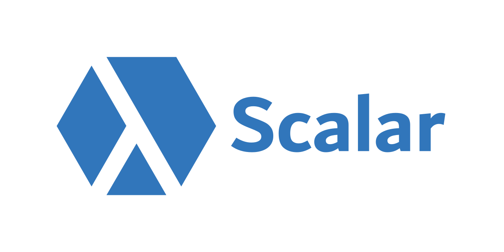

## What is Scalar?

Scalar is an opinionated repository management tool. By creating new
repositories or registering existing repositories with Scalar, your Git
experience will speed up. Scalar sets advanced Git config settings,
maintains your repositories in the background, and helps reduce data sent
across the network.

You can learn more about Scalar in this video: [Git at Scale for Everyone](https://www.youtube.com/watch?v=USLB1gwl1vA).

## Table of Contents

* [Getting Started](#getting-started)
* [Example Workflow](#example-workflow)
* [License](#license)
* [Code of Conduct](#code-of-conduct)

## Getting Started

Full details can be found in [our documentation page](https://github.com/microsoft/scalar/blob/HEAD/docs/index.md).

### Installing on macOS

Scalar is installed and updated on macOS via [Homebrew](https://brew.sh/).

```sh
brew tap microsoft/git
brew cask install scalar
```

If you wish to use the [GVFS Protocol][gvfs-protocol], then you will
instead need the cask that uses [our custom fork of Git][microsoft-git]:

```sh
brew tap microsoft/git
brew cask install scalar-azrepos
```

When new versions of Scalar are available, you can upgrade in a few
different ways. First, you can use `brew`:

```sh
brew update

# Use only one of the following, depending on which you have installed:
brew upgrade --cask scalar
brew upgrade --cask scalar-azrepos
```

Alternatively, you can run `scalar upgrade` and it will run the necessary
`brew` commands on your behalf.

If your repository has many files in the working directory, then you might
want to install [Watchman](https://github.com/facebook/watchman), which
Scalar will detect and configure with Git's File System Monitor feature.

```sh
brew install watchman
```

### Installing on Windows

To install Scalar on Windows, download `Installers_Windows_Release.zip`
from the [latest release](https://github.com/microsoft/scalar/releases)
and extract all of the files.  Run the contained installers for Git and
Scalar, with names matching these patterns:

 * `Git\Git-2.XX.Y-vfs.*.*-64-bit.exe`
 * `Scalar\SetupScalar.YY.MM.<sprint>.<minor>.exe`

_Note: we are investigating package management tools to have the Windows
install process be as simple as the `brew` process on macOS. See
[#433](https://github.com/microsoft/scalar/issues/433) for progress on
this feature._

Installing on Linux
-------------------

Currently, we package a custom version of Git and Scalar as `.deb` packages
that can be installed after downloading from the GitHub releases pages.
In order to get background maintenance as part of `scalar clone` or
`scalar register`, you need to be running Git 2.30.0 or higher.
Alternatively, you can install our custom version of Git.

The latest releases can be downloaded and installed as follows:

> Note: If you don't have `wget`, then try `sudo apt-get install wget` first.

```sh
# (Optional, if running Git below 2.30.0)
# Install git-vfs, a custom fork of Git
wget https://github.com/microsoft/git/releases/download/v2.29.0.vfs.0.0/git-vfs_2.29.0.vfs.0.0.deb
sudo dpkg -i git-vfs_2.29.0.vfs.0.0.deb

# Install GCM Core
wget https://github.com/microsoft/Git-Credential-Manager-Core/releases/download/v2.0.252-beta/gcmcore-linux_amd64.2.0.252.766.deb
sudo dpkg -i gcmcore-linux_amd64.2.0.252.766.deb
git-credential-manager-core configure

# Install Scalar
wget https://github.com/microsoft/scalar/releases/download/v20.10.178.6/scalar-azrepos-linux_amd64.20.10.178.0.deb
sudo dpkg -i scalar-azrepos-linux_amd64.20.10.178.0.deb

# Test installation
git version
git-credential-manager-core version
scalar version
```

We are working to provide a package via `apt-get` to make this installation
easier and better for automatically upgrading.

The current installation via `.deb` package only works on Debian-based
Linux distributions. The software has only been compiled and tested with x86_64/amd64
architectures. Motivated users can install [`microsoft/git`](https://github.com/microsoft/git)
and Scalar from source. See [the `InstallFromSource.sh` script](https://github.com/microsoft/scalar/blob/2dc48243c50763024b048c5f36d5f50835943dda/Scripts/Linux/InstallFromSource.sh#L62-L76)
for assistance installing Scalar from source.

### Basic Scalar Use

To create a new local repository from a remote repository, run

```sh
scalar clone [--full-clone] <url> [<dir>]
```

If the given `<url>` is hosted by Azure Repos, then the clone will use
[the GVFS Protocol](gvfs-procool)
to reduce the amount of data sent across the network. Otherwise, this will
attempt to use [Git's partial clone feature](https://git-scm.com/docs/git-clone#Documentation/git-clone.txt---filterltfilter-specgt)
to achieve similar results.

If you already have a local Git repository and do not want to clone a new
one, you can get many of the benefits of Scalar by registering your repository
using the `scalar register` command.

```sh
scalar register
```

After either of these commands, your repositories will be initialized with
advanced Git performance features and will be maintained in the background
according to our recommended maintenance schedule.

## Example Workflow

If you want to get a feel for an initial workflow with a test project, here
are some commands that clone [our test repo](https://dev.azure.com/gvfs/ci/_git/ForTests)
and initialize the sparse-checkout definition to grow the working directory.

Run these commands in Terminal on macOS or in Git Bash on Windows.

First, clone the repository using the GVFS protocol.

```sh
$ scalar clone https://dev.azure.com/gvfs/ci/_git/ForTests
Clone parameters:
  Repo URL:     https://dev.azure.com/gvfs/ci/_git/ForTests
  Branch:       Default
  Cache Server: Default
  Local Cache:  C:\.scalarCache
  Destination:  C:\_git\ForTests
  FullClone:     False
Authenticating...
Querying remote for config...
Using cache server: None (https://dev.azure.com/gvfs/ci/_git/ForTests)
Cloning...
Fetching commits and trees from origin (no cache server)...
Configuring Watchman...
Validating repo...
Complete!
```

Then, navigate into the repository's `src` directory.
(*Related:* [Why does `scalar clone` create a `src` folder?](https://github.com/microsoft/scalar/blob/main/docs/faq.md#why-does-scalar-clone-create-a-reposrc-folder))

```sh
$ cd ForTests/src
$ ls -a
./   .git/           .gitignore         GvFlt_EULA.md  License.md    Protocol.md  Settings.StyleCop
../  .gitattributes  AuthoringTests.md  GVFS.sln       nuget.config  Readme.md
```

This directory is the _working directory_, which contains all files
tracked by Git. It also includes the `.git` directory and its contents.

The working directory does not contain any subdirectories (other than the
`.git` directory). This is due to the initial sparse-checkout definition
which only cares about the files at root. We can expand the sparse-checkout
using the `git sparse-checkout set` and `git sparse-checkout add` commands:

```sh
$ git sparse-checkout set GVFS/GVFS.Common GVFS/GVFS.UnitTests GitHooksLoader
$ ls -a
./   .git/           .gitignore         GitHooksLoader/  GVFS/     License.md    Protocol.md  Settings.StyleCop
../  .gitattributes  AuthoringTests.md  GvFlt_EULA.md    GVFS.sln  nuget.config  Readme.md

$ ls GVFS
GVFS.Common/  GVFS.UnitTests/  LibGit2Sharp.NativeBinaries.props  ProjectedFSLib.NativeBinaries.props

$ git sparse-checkout add GVFS/GVFS
$ ls GVFS
GVFS/  GVFS.Common/  GVFS.UnitTests/  LibGit2Sharp.NativeBinaries.props  ProjectedFSLib.NativeBinaries.props
```

[Learn more about sparse-checkout here](https://github.blog/2020-01-17-bring-your-monorepo-down-to-size-with-sparse-checkout/).

## License

The Scalar source code in this repo is available under the MIT license. See [License.md](License.md).

## Code of Conduct

This project has adopted the [Microsoft Open Source Code of Conduct][conduct-code].
For more information see the [Code of Conduct FAQ][conduct-FAQ] or contact [opencode@microsoft.com][conduct-email] with any additional questions or comments.


[gvfs-protocol]: https://github.com/microsoft/VFSForGit/blob/HEAD/Protocol.md
[microsoft-git]: https://github.com/microsoft/git
[conduct-code]: https://opensource.microsoft.com/codeofconduct/
[conduct-FAQ]: https://opensource.microsoft.com/codeofconduct/faq/
[conduct-email]: mailto:opencode@microsoft.com
